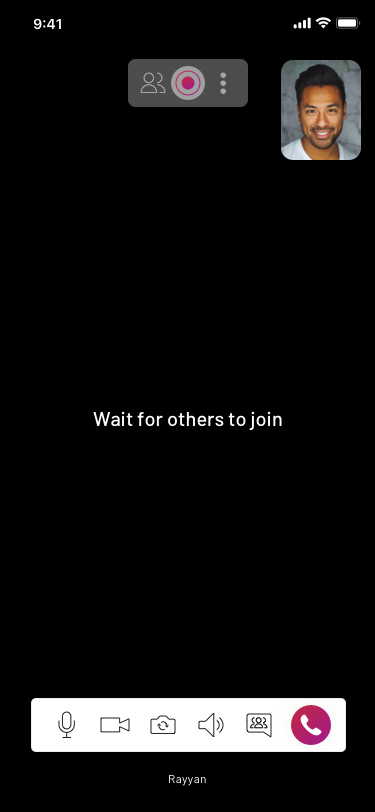
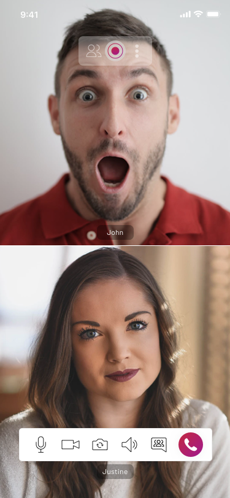
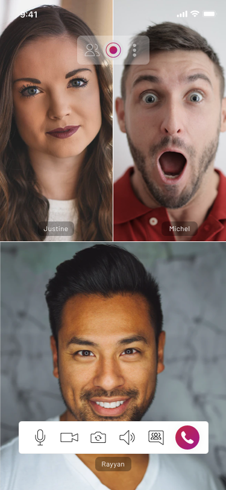
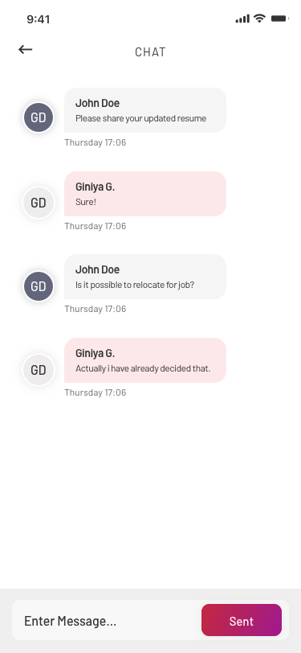
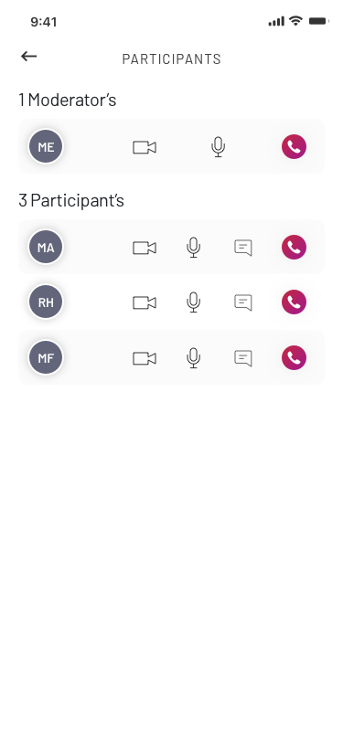

# EnableX Video Calling Flutter app with UIKit

This is a sample video calling app that uses EnableX infrastructure, APIs and Toolkit. It allows developers to try out real-time video and audio features on Flutter.

This sample apps allows you to easily:
* Create a Virtual Room with REST video API
* Gain the Room Credentials (i.e. Room ID)
* Join Virtual Room either as moderator or partipicant securely

You will also enjoy the following features:
## For Participants and Moderators
* Mute Self-Audio
* Mute Self-Video
* Switch Camera
* Switch Audio Device
* Group and Private Chat

## Participant List
* Switch Layout
* Disconnect Call
* Raise Hand to Join the Floor (only for webinar mode)

## For Moderators only
* Record Session
* Mute Room
* Mute Participant-Audio
* Mute Participant-Video
* Drop Participant from room
* Allow/deny Participant’s Raised Hand Request (only for webinar mode)
* Revoke Allowed Raised Hand Request (only for webinar mode)

> For more information, pls visit our Developer Center https://www.enablex.io/developer/video/solutions/video-ui-kit/ios-video-ui-kit/

## 1. Get started

### 1.1 Prerequisites

#### 1.1.1 App ID and App Key

You would need API Credentials to access EnableX platform. To do that, simply create an account with us. It’s absolutely free!

* Create an account with EnableX - https://portal.enablex.io/cpaas/trial-sign-up/
* Create your Project
* Get your App ID and App Key delivered to your email

#### 1.1.2 Requirement

* Android Studio
* Language: Either Kotlin or java


#### 1.1.3 Sample Flutter Client

* Clone or download this Repository : https://github.com/EnableX/Audio-Video-Chat-Application-Sample-with--UIKit-for-IOS.git

#### 1.1.4 Application Server

An Application Server is required for your Flutter App to communicate with EnableX. We have different variants of Application Server Sample Code. Pick the one in your preferred language and follow instructions given in README.md file of respective Repository.

* NodeJS: https://github.com/EnableX/Video-Conferencing-Open-Source-Web-Application-Sample.git
* PHP: https://github.com/EnableX/Group-Video-Call-Conferencing-Sample-Application-in-PHP

Note the following:
•	You need to use App ID and App Key to run this Service.
•	Your Flutter Client EndPoint needs to connect to this Service to create Virtual Room and Create Token to join the session.
•	Application Server is created using [EnableX Server API](https://www.enablex.io/developer/video-api/server-api) while Rest API Service helps in provisioning, session access and post-session reporting.

If you would like to test the quality of EnableX video call before setting up your own application server,  you can run the test on our pre-configured environment. Refer to point 2 for more details on this.

### 1.2 Configure Flutter Client

* Open the App
* Go to VCXConstant.swift, it's reads:

``` 
 /* To try the App with Enablex Hosted Service you need to set the kTry = true
    When you setup your own Application Service, set kTry = false */
    
    let kTry = true

 /* Your Web Service Host URL. Keet the defined host when kTry = true */
    
    let kBasedURL = "https://demo.enablex.io/"
     
 /* Your Application Credential required to try with EnableX Hosted Service
    When you setup your own Application Service, remove these */
    
    let kAppId    = ""
    let kAppkey   = ""
 
 ```

### 1.3 Test

#### 1.3.1 Open the App

* Open the App in your Device. You get a form to enter Name, Room ID and Role (Moderator or Participant).
* If you don't have a Room ID, create a Room by clicking the "Create Room" button.
* Enter the Room ID in the Form to connect to the Virtual Room to carry out an RTC Session either as a Moderator or a Participant.
* Share Room ID with others to join the Virtual Room with you.

Note:
* This Sample Application created a Virtual Room with limited Participant and 1 Moderator only.
* In case of emulator/simulator your local stream will not create. It will create only on real device.

## 2. Testing Environment

If you would like to test the quality of EnableX video call before setting up your own Application server,  you can run the test on our [pre-configured environment.](https://try.enablex.io/)
In this environment, you will only be able to:

* Conduct a single session with a total durations of not more than 15 minutes
* Host a multiparty call with no more than 6 participants

> More information on Testing Environment: https://developer.enablex.io/video/sample-code/#demo-app-server

Once you have tested it, it is important that you set up your own Application Server to continue building a one to one or multiparty Flutter video calling app. Refer to section 1.1.4 on how to set up the Application Server.

## 3. Flutter UIKit

This Sample Application uses EnableX Flutter UIKit to communicate with EnableX Servers to initiate, manage Real-Time Communications and create a beautify & customized Audio/Video call UI. Please update your Application with latest version of EnableX Flutter UIKit as and when a new release is available.



```
    Only one user join
```



```
    Two users join
```



```
    Multiple users join
```




```
    Chat page
```



```
    lis of avaliable Participants in session
```


# Here to beautify & customized the UI as follow

## Customize Bottom Bar

var setting = EnxSetting.instance;
setting.createBottomOption(BottomOption.audio);
setting.createBottomOption(BottomOption.video);
setting.createBottomOption(BottomOption.groupChat);
setting.createBottomOption(BottomOption.disconnect);
setting.createBottomOption(BottomOption.cameraSwitch);
T
    
## Customize Top Bar

var setting = EnxSetting.instance;
setting.createTopOption(TopOption.userList);
setting.createTopOption(TopOption.requestFloor);
setting.createTopOption(TopOption.menu);


# For more check this below document
* Documentation: https://www.enablex.io/developer/video/solutions/video-ui-kit/flutter-video-ui-kit/
* Download: https://pub.dev/packages/enx_uikit_flutter


## 4. Support

EnableX provides a library of Documentations, How-to Guides and Sample Codes to help software developers get started.

> Go to https://developer.enablex.io/.

You may also write to us for additional support at support@enablex.io.   
